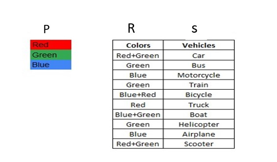

# Noisy_Lion-Assignment

## First Task

1) This is a Data Analysis project, here I want to create drop down based on shirt type, colour, size and season and that drop down should be interactive with Resource, Hourly cost, Round 1, Round 2, Round 3, Round 4, Service cost and Total cost.
In short, when user changes shirt type, colour, size, season options then empty Cells should fill with their corresponding data.

# 
2)	Here, we can see that T shirt is selected from the option and then data is changed to their corresponding values, so this was the project, I have use Index function and formula to bring certain value from data sheet, here the data sheet is in different excel sheet, basically I have linked the data sheet with this sheet. When we select proper data from drop down than the value occurs and easily, we get accurate data.

 We can use this type of method in schools for getting results of particular student from huge data, In companies, In government projects, etc.

## Second Task

1) I want to create a method by which when, I click on Red in P column all the vehicles in column S which are red colour will be highlighted. For the vehicles which have two colours. for example, the Car has Red+Green, the Car must be highlighted when I click on Red or Green. [Note: The trigger should be by click]

#
2)	Basically, I have created buttons and Assign Macro. After creating it, I have written formula in which when we click on red button in column P than all vehicles in column s will fill with red colour and so on.

#

3)	This is formula which I have use,

 (It is of blue color)

#

4) When we click on above button- Red, Blue, Green and Remove all Color, then colour will get immediately highlight. 

 
 

